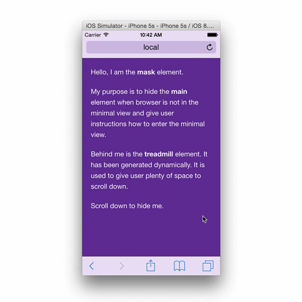

<!--
This file has been generated using GitDown (https://github.com/gajus/gitdown).
Direct edits to this will be be overwritten. Look for GitDown markup file under ./.gitdown/ path.
-->
<h1 id="brim">Brim</h1>

[](https://www.npmjs.org/package/brim)
[](http://bower.io/search/?q=brim)

View ([minimal-ui](#minimal-ui)) manager for iOS 8.

[Try it](http://gajus.com/sandbox/brim/demo/) and [tweet it](https://twitter.com/intent/retweet?tweet_id=532479715366674432) if you like it.



<h2 id="brim-contents">Contents</h2>

* [Brim](#brim)
    * [Contents](#brim-contents)
    * [minimal-ui](#brim-minimal-ui)
    * [Features](#brim-features)
    * [Setup](#brim-setup)
    * [The Underlying Implementation](#brim-the-underlying-implementation)
    * [Quick Start](#brim-quick-start)
    * [Styling](#brim-styling)
    * [Events](#brim-events)
        * [viewchange](#brim-events-viewchange)
    * [Detecting iOS 8](#brim-detecting-ios-8)
    * [Download](#brim-download)


<h2 id="brim-minimal-ui">minimal-ui</h2>

In [iOS 7.1](https://developer.apple.com/library/ios/releasenotes/General/RN-iOSSDK-7.1/index.html), a property, minimal-ui, has been added for the viewport meta tag key that allows minimizing the top and bottom bars in Safari as the page loads. While on a page using minimal-ui, tapping the top bar brings the bars back. Tapping back in the content dismisses them again.

The minimal-ui viewport property is [no longer supported](https://developer.apple.com/library/ios/releasenotes/General/RN-iOSSDK-8.0/) in iOS 8. However, the minimal-ui itself is not gone. User can enter the minimal-ui with a "touch-drag down" gesture.

There are several pre-conditions and obstacles to manage the view state, e.g. for minimal-ui to work, there has to be enough content to enable user to scroll; for minimal-ui to persist, window scroll must be offset on page load and after orientation change. However, [there is no way of calculating the dimensions of the minimal-ui](http://stackoverflow.com/questions/26801943/how-to-get-the-window-size-of-fullscreen-view-when-not-in-fullscreen) using the `screen` variable, and thus no way of telling when user is in the minimal-ui in advance.

<h2 id="brim-features">Features</h2>

Brim solves all of the issues associated with determining the state of the UI and controlling the persistence. Specifically:

* Determines when user is in the minimal-ui.
* Determines when the view changes.
* Provides a UI to instruct user to enter the minimal-ui.
* Locks user in the minimal-ui (following the spec defined in the iOS 7.1).
* Makes the view persist when page is reloaded or device orientation changes.

<h2 id="brim-setup">Setup</h2>

You need to create two elements: mask and main. **Mask** is displayed to the user when page is in the full view. The role of the element is to instruct user to enter the minimal-ui. **Main** element is shown when mask is hidden.

* These elements must be direct and sole descendants of `<body>`.
* The IDs must be `brim-mask` and `brim-main`.
* Do not apply [styling](#styling) that would affect the position or the dimensions of these elements.

<h2 id="brim-the-underlying-implementation">The Underlying Implementation</h2>

When page is loaded, Brim will create a **treadmill** element. Treadmill element is used to give user space to scroll. Presence of the treadmill element ensures that user can enter the minimal-ui view and that it continues to persist if user reloads the page or changes device orientation. It is invisible to the user the entire time. This element has ID `brim-treadmill`.

Upon loading the page or after changing the orientation, Brim is using [Scream](https://github.com/gajus/scream) to detect if page is in the minimal-ui view (page that has been previously in minimal-ui and has been reloaded will remain in the minimal-ui if content height is greater than the viewport height).

When page is in the minimal-ui, Brim will disable scrolling of the document (it does this in a [safe way](http://stackoverflow.com/a/26853900/368691) that does not affect the contents of the main element). Disabling document scrolling prevents accidentally leaving the minimal-ui when scrolling upwards. As per the original iOS 7.1 spec, tapping the top bar brings back the rest of the chrome.

When page is in the full view, Brim will show the mask element.

<h2 id="brim-quick-start">Quick Start</h2>

```html
<!DOCTYPE html>
<html>
<head>
    <script src="./bower_components/scream/dist/scream.js"></script>
    <script src="./bower_components/brim/dist/brim.js"></script>
    <script>
    window.addEventListener('DOMContentLoaded', function () {
        var scream,
            brim;

        scream = gajus.Scream({
            width: {
                portrait: 320,
                landscape: 640
            }
        });

        brim = gajus.Brim({
            viewport: scream
        });
    });
    </script>
</head>
<body>
    <div id="brim-mask">
        <!-- Content displayed to the user when in full view. -->
    </div>
    <div id="brim-main">
        <!-- Content displayed to the user when in minimal view.  -->
    </div>
</body>
</html>
```

<h2 id="brim-styling">Styling</h2>

If mask element does not have active content, it is advisable to disable pointer events:

```css
#brim-mask {
    pointer-events: none;
}
```

Do not set style that would change position or dimensions of the mask or the main element.

Do not style the treadmill.

<h2 id="brim-events">Events</h2>

<h3 id="brim-events-viewchange">viewchange</h3>

Invoked on page load and when view changes.

```js
brim.on('viewchange', function (e) {
    // Invoked when view changes.

    // @var {String} 'full', 'minimal'
    e.viewName;
});
```

<h2 id="brim-detecting-ios-8">Detecting iOS 8</h2>

Brim does not have a use case outside of iOS 8, though it does not restrict itself. I recommend using [platform.js](https://github.com/bestiejs/platform.js/) to target the platform:

```js
if (platform.os.family == 'iOS' && parseInt(platform.os.version, 10) >= 8) {
    // Use Scream & Brim.
}
```

<h2 id="brim-download">Download</h2>

Using [Bower](http://bower.io/):

```sh
bower install brim
```

Using [NPM](https://www.npmjs.org/):

```sh
npm install brim
```
